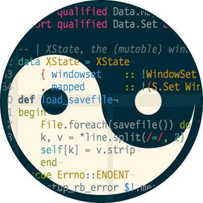

    
    <h1>Solarized for Google Chrome</h1>
    
    
    

&nbsp;

Solarized dark and light **Google Chrome** themes.

| [Dark](https://raw.githubusercontent.com/talohana/solarized-google-chrome/main/images/ss-solarized-dark.png)  | [Light](https://raw.githubusercontent.com/talohana/solarized-google-chrome/main/images/ss-solarized-light.png)  |
| ------------------------------------------------------------------------------------------------------------- | --------------------------------------------------------------------------------------------------------------- |
|  |  |

## :busts_in_silhouette: Maintainers

|  |
| ------------------------------------------------------------------------------------ |
| [talohana](https://github.com/talohana)                                              |
